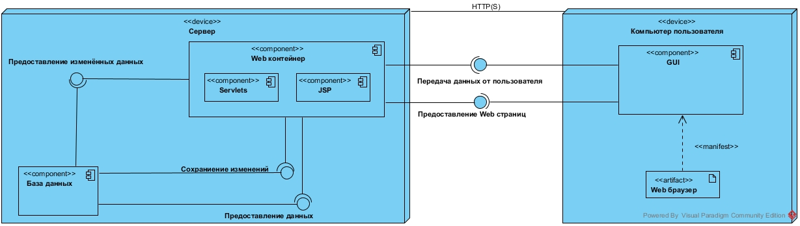
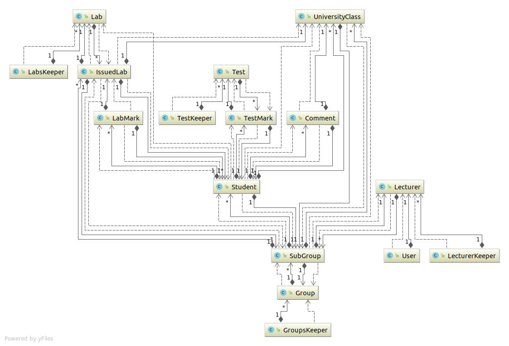
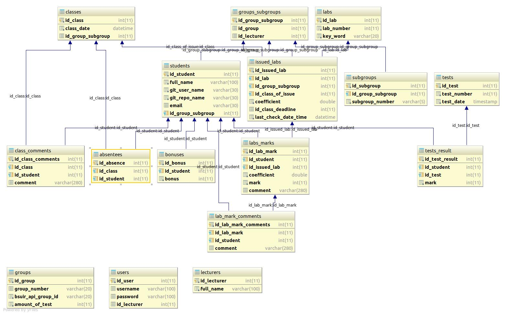
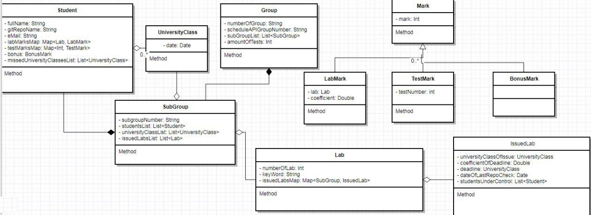
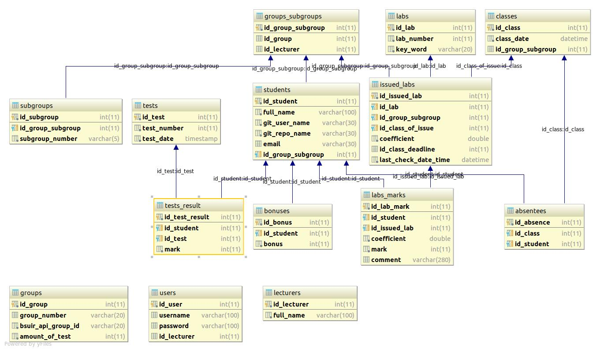

# Часть 1
## 1.	Тип приложения
Веб-приложение – клиент-серверное приложение, в котором клиент взаимодействует с сервером при помощи браузера, а за сервер отвечает – веб-сервер.
## 2.	Стратегия развёртывания 
Нераспределенное развертывание.
## 3. Выбор технологии
  - Java – самый распространенный язык для веб-сервисов. Преимущества – простота применения, независимость от платформы и встроенные функции.
  - JS – предоставляет возможности для создания клиентской части приложения, поддерживает AJAX.
  - jQuery – помогает легко получать доступ к любому элементу DOM, обращаться к атрибутам и содержимому элементов DOM, манипулировать ими. 
  - JSP – серверная технология для создания веб-страниц. Используется при создании динамических странц и предоставляет возможность горячего развертывания.
  - Hibernate – освобождение разработчика от значительного объёма сравнительно низкоуровневого программирования при работе в объектно-ориентированных средствах в реляционной базе данных.
  - Apache Tomcat - контейнер сервлетов с открытым исходным кодом. Реализует спецификацию сервлетов, спецификацию JSP и JavaServer Faces(JSF). Tomcat позволяет запускать веб-приложения, содержит ряд программ для самоконфигурирования.
## 4. Показатели качества
  - Безопасность;
  - Корректное отображение интерфейса;
  - Скорость работы;
  - Надежность;
  - Актуальность;
## 5.  Пути реализации сквозной функциональности: 
  - Аутентификация: обеспечить безопасность при входе путем использования только post-запросов и хэширования паролей.
  - Авторизация: защита ресурсов посредством авторизации вызывающей стороны.
  - Сетевое взаимодействие: выбирать соответствующие транспортные протоколы
  - Хэширование: применить алгоритм SHA-1, который позволяет шифровать пароли без возможности разшифрования.
 ## 6. To be architecture:
 1. Диаграмма компонентов.

 2. Диаграмма классов.

 3. Структура базы данных.

 # Часть 2
 ## As is architecture:
  1. Диаграмма компонентов.

 2. Диаграмма классов.

 3. Структура базы данных.

 # Часть 3
   Добавление в приложение нового функционала вызвало внесение некоторых корректировок в структуру БД и привело к изменениям архитектуры, которые заметны на диаграммах классов.   
