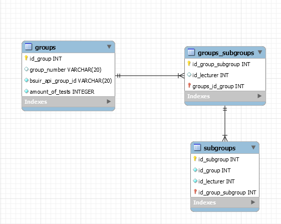
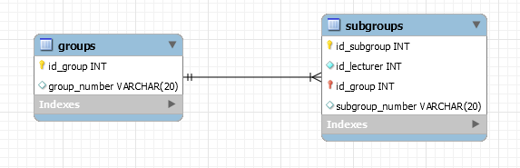

# Технический долг
1. [Технический долг](#td)
2. [План мероприятий по устранению технического долга](#mtd)
3. [Сравнение объёма долга и недоимплементированных фич](#compare)
4. [Результаты устранения технического долга](#resault)

<a name="td"/>

## Технический долг в проекте

<a name="unreadable_before"/>

### Непонятный / нечитабельный код
[Пример нечитабельного кода при проверке репозиториев](https://github.com/Andrlis/Review-Assistant/blob/b82484c6c66273e4c16f8190308cae94ff754020/src/main/java/checker/Checker.java)

[после устранения ТД](#unreadable_after)

<a name="duplicate_code_before"/>

### Дублирующийся кода
Отличный пример дублирующегося кода - бльшое количество методов get...ById при работе с БД([файл до рефакторинга](https://github.com/Andrlis/Review-Assistant/blob/18c70b3ffb3d62af002e02acb7dec2d4cb049ae8/src/main/java/resources/Hibernate/HibernateCore.java)):
```java
public Comment getCommentById(Integer id) throws HibernateShellQueryException {
  final Session session = getSession();
  Comment comment = null;
  try {
    comment = (Comment) session.get(Comment.class, id);
  } catch (Exception e) {
    throw new HibernateShellQueryException(e);
  } finally {
    session.close();
  }

  return comment;
}
```
```java
public TestMark getTestMarkById(Integer id) throws HibernateShellQueryException {
  final Session session = getSession();
  TestMark testMark = null;
  try {
    testMark = (TestMark) session.get(TestMark.class, id);
  } catch (Exception e) {
    throw new HibernateShellQueryException(e);
  } finally {
    logger.info("Close session.");
    session.close();
  }

  return testMark;
}
```
```java
public UniversityClass getUniversityClassById(Integer id) throws HibernateShellQueryException {
  final Session session = getSession();
  UniversityClass universityClass = null;
  try {
    universityClass = (UniversityClass) session.get(UniversityClass.class, id);
  } catch (Exception e) {
    throw new HibernateShellQueryException(e);
  } finally {
    logger.info("Close session.");
    session.close();
  }

  return universityClass;
}
```
[после устранения ТД](#duplicate_code_after)

### Отсутствие автоматизации (тестов, сборки, развёртывания)
Отсутсвует автоматизация тестов, сборки.

<a name="architecture_before"/>

### Запутанная архитектура и ненужные сложные зависимости
Превосходный пример запутанной архитектуры - [усложнённая работа с БД](https://github.com/Andrlis/Review-Assistant/tree/5bd456b8c874fd04ebf2f4d1b27b021e63b9f9de/src/main/java/resources/Hibernate):


Основные ошибки, допущенные при приектировании:
- Отсутствие в коде интерфейсов.
- Большое колличество повторяющегося кода.
- Искуственно усложнённая работа с БД.

[после исправления ТД](#architecture_after)

Так же таблицы БД и связи были спроектированы на ранних этапах разработки, и т.к. концепция приложения претерпела изменения, структру БД можно (или даже необходимо) было поменять. Казалось, что фундаментальные изменения потребуют больших затрат на восстановление работоспособности веб-пиложения, но изменения следующих таблиц:



не привело к серьезным ошибкам. Можно изучить [результат изменений](#architecture_after).

### Медленные / неэффективные средства
Основное время работы нашего приложения - работа с БД. Время обращения увеличивается ещё больше из-за сложных зависимостей, лишних таблиц в БД, отсутсвия lazyCollection.
### Незакоммиченый код / долгоживущие ветки
На момента начала написания данного отчёта, в проекте существует 3 ветки:


Только одна из них (master) используется по назвачению.

<a name="tests_defore"/>

### Отсутствие тестовой среды
До устранения ТД тесты находятся в неактуальном состоянии. В части тестов отсутствовола необъодимость. Некоторые тесты не работали либо работали неправильно.
В проекте не использовалось мутационное тестирование.


[после устанения ТД](#tests_after)

<a name="mtd"/>

## План мероприятий по устранению технического долга
- Провести рефакторинг работы с БД
- Провести рефакторинг работы с BSUIR API
- Покрыть код тестами
- Использовать мутационное тестирование
- Упростить структуру БД
- Уничтожить неиспользуемые ветки

<a name="compare"/>

## Сравнение объёма долга и недоимплементированных фич
Рефакторинг работы с БД и BSUIR API, в дальнейшем, позволит упростить написание unit тестов. И в целом упростит дальнейшее написание кода. Таким образом целесообразно провести данные мероприятия.

Покрытие кода тестами позволит ускорить цикл интеграции.

Изменение структуры БД ускорит работу приложения.

Задачи рефакторинга работы с  BSUIP API и БД приоритны, т.к. позволят упростить и ускорить дальнейшую разработку проекта.

<a name="resault"/>

## Результаты устранения технического долга

<a name="unreadable_after"/>

### Непонятный / нечитабельный код
Для устанения непонтного кода, был  применён патерн рефакторинга - Извлечение метода. Это позволило убрать слишком длинный метод, уменьшить сложностью внутри метода и облегчить последующую работу с ним. 
[Код после рефакторинга](https://github.com/Andrlis/Review-Assistant/blob/master/src/main/java/checker/RepositoryChecker.java)

[до устранения ТД](#unreadable_before)

<a name="duplicate_code_after"/>

### Дублирующийся кода
После рефакторинга, для получения любой сущности по её id используется один метод([файл после рефакторинга](https://github.com/Andrlis/Review-Assistant/blob/master/src/main/java/dao/DataBaseCore.java)):
```java
public Object getById(Class c, Integer id) throws DataBaseQueryException {
  logger.info("DataBaseCore.getById(). " + c.getName());

  final Session session = getSession();
  Object answer;

  try {
    answer = (Object) session.get(c, id);
  } catch (Exception e) {
    throw new DataBaseQueryException(e);
  } finally {
    session.close();
  }

  return answer;
}
```
[до устранения ТД](#duplicate_code_before)

<a name="architecture_after"/>

### Запутанная архитектура и ненужные сложные зависимости
После рефакторинга были исправлены основные ошибки. Так же рефакторинг позволит в дальнейшем писать более качественные unit тесты, за счёт выделения основных интерфейсов.


Рефакторинг позволяет писать более простые SQL-скрипты для добаления данных. Текущие связи более прозрачны и требую меньше затрат ресурсов на получение данных.



[до устранения ТД](#architecture_before)
<a name="tests_after"/>

### Отсутствие тестовой среды

[до устранения ТД](#tests_defore)
